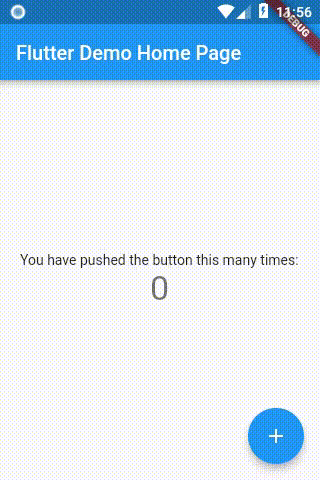

# e043_flutter_setstate_initstate_problem

## Screen Record

## What

- the setState not updating the UI when variables is manipulated inside build method

## Problem Code

    class _MyHomePageState extends State<MyHomePage> {
        int _counter;

        @override
        Widget build(BuildContext context) {
        _counter = 0;
        }

        void _incrementCounter() {
            setState(() {
                _counter++;
            });
        }
    }

## solution A Code

    class _MyHomePageState extends State<MyHomePage> {
        int _counter = 0;

        @override
        Widget build(BuildContext context) {
        //_counter = 0;
        }

        void _incrementCounter() {
            setState(() {
                _counter++;
            });
        }
    }

## solution B Code

    class _MyHomePageState extends State<MyHomePage> {
        //int _counter = 0;
        int _counter ;

        @override
        void initState() {
            super.initState();
            _counter = 0;
        }
        @override
        Widget build(BuildContext context) {
        //_counter = 0;
        }

        void _incrementCounter() {
            setState(() {
                _counter++;
            });
        }
    }

## Ref
